# GAMING TERMINAL Launchpad

A comprehensive memecoin launchpad protocol on Solana featuring bonding curve token launches, automated market maker integration, vesting mechanisms, points-based rewards system, and fair launch mechanics with anti-rug features.

## 🚀 Overview

The Gaming Terminal Launchpad is a decentralized platform for launching gaming tokens on Solana with built-in trading, staking, and rewards mechanisms. It uses bonding curves to ensure fair price discovery and provides a complete ecosystem for token creators and traders.

## 📋 Table of Contents

- [Features](#features)
- [Smart Contract Architecture](#smart-contract-architecture)
- [Endpoints](#endpoints)
- [Models](#models)
- [Configuration](#configuration)
- [Fee Structure](#fee-structure)
- [Workflow](#workflow)
- [Installation](#installation)
- [Usage](#usage)

## ✨ Features

### 🏗️ Core Features

- **Bonding Curve Launches**: Fair price discovery mechanism for new tokens
- **Direct Trading**: Swap SOL ↔ Meme tokens with real-time pricing
- **Token Metadata**: Create and manage token metadata via Metaplex
- **Anti-Rug Protection**: Built-in safeguards against malicious activities
- **Points Rewards**: Earn points for trading activities
- **Referral System**: Reward community growth through referrals
- **Airdrop Management**: Automated airdrop distribution system

### 🛡️ Security Features

- **Pool Locking**: Prevents manipulation during critical periods
- **Vesting Periods**: Time-locked token distributions (1-13 days)
- **Admin Fee Collection**: Platform sustainability through trading fees
- **PDA Authority**: Secure program-derived address management

## 🏛️ Smart Contract Architecture

### Core Modules

```
src/
├── lib.rs              # Main program entry point
├── consts.rs           # Global constants and configurations
├── err.rs              # Error definitions and handling
├── endpoints/          # All instruction handlers
├── models/             # Data structures and account definitions
├── libraries/          # Utility functions and math operations
└── math/               # Advanced mathematical computations
```

## 🗂️ Project Structure & Components

### 📋 **Core Files**

#### `lib.rs` - Main Program Controller

**Purpose:** The central hub that exposes all program functions to external users
**What it does:**

- Acts as the "front desk" routing all user requests
- Declares all available endpoints (functions users can call)
- Imports and organizes all modules
- Contains the main `#[program]` macro defining the Solana program

**Key Functions Exposed:**

```rust
- new_pool()           // Create new token pools
- create_metadata()    // Add token name/symbol/image
- swap_x()            // Sell meme tokens for SOL
- swap_y()            // Buy meme tokens with SOL
- get_swap_x_amt()    // Preview sell prices
- get_swap_y_amt()    // Preview buy prices
- send_airdrop_funds() // Distribute free tokens
```

#### `consts.rs` - Configuration Settings

**Purpose:** Contains all global constants and configuration values
**What it stores:**

- **Token Economics:** Total supply (1B), distribution ratios
- **Fee Rates:** 1% SOL fees, 0% meme token fees
- **Time Limits:** Vesting periods, lock times for different environments
- **Wallet Addresses:** Admin keys, fee collection addresses
- **Mathematical Constants:** Precision values, scaling factors

**Key Constants:**

```rust
- MAX_MEME_TOKENS: 1,000,000,000     // Total token supply
- DEFAULT_MAX_M: 690,000,000         // Trading pool allocation
- DEFAULT_MAX_M_LP: 310,000,000      // LP pool allocation
- FEE: 10,000,000                    // 1% platform fee
- MAX_AIRDROPPED_TOKENS: 100,000,000 // Max airdrop amount
```

#### `err.rs` - Error Handling System

**Purpose:** Defines all possible errors and their messages
**What it prevents:**

- Program crashes from invalid inputs
- Unclear error messages for debugging
- Security vulnerabilities from unhandled edge cases

**Common Error Types:**

```rust
- NoZeroTokens        // Prevents 0-amount trades
- PoolIsLocked        // Blocks trading when pool is paused
- InsufficientBalance // Checks user has enough tokens
- SlippageExceeded    // Protects against price manipulation
- InvalidTokenMints   // Ensures correct token types
```

### 📁 **Endpoints Folder** - Action Handlers

#### Pool Management

**`new_pool.rs`** - Token Pool Factory

- **Function:** Creates new bonding curve pools for meme tokens
- **Process:**
  1. Validates input parameters (airdrop amount, vesting period)
  2. Mints 1 billion total tokens to pool vault
  3. Configures bonding curve mathematics (price calculation)
  4. Sets up fee collection and admin controls
  5. Initializes trading reserves (690M for trading, 310M for LP)

**`create_metadata.rs`** - Token Information Manager

- **Function:** Adds name, symbol, and image to tokens via Metaplex
- **Process:**
  1. Creates Metaplex metadata account
  2. Sets token name, symbol, and URI (image/description)
  3. Assigns creator verification
  4. Removes mint authority (prevents infinite token creation)

#### Trading System

**`swap_x.rs`** - Sell Meme Tokens for SOL

- **Function:** Executes meme token → SOL trades
- **Process:**
  1. Validates user has sufficient meme tokens
  2. Calculates bonding curve price
  3. Applies 1% fee in SOL
  4. Transfers meme tokens from user to pool
  5. Transfers SOL from pool to user
  6. Updates pool reserves and fee accumulation

**`swap_y.rs`** - Buy Meme Tokens with SOL

- **Function:** Executes SOL → meme token trades
- **Process:**
  1. Validates SOL input amount
  2. Calculates bonding curve price
  3. Collects 1% fee in SOL
  4. Transfers SOL from user to pool
  5. Transfers meme tokens from pool to user
  6. Distributes reward points to referrers (if provided)

**`get_swap_x_amt.rs` & `get_swap_y_amt.rs`** - Price Preview

- **Function:** Shows expected trade amounts without executing
- **Use Cases:** Frontend price display, slippage calculation, trade simulation

#### Rewards System

**`send_airdrop_funds.rs`** - Token Distribution

- **Function:** Distributes free tokens from staking pools
- **Security:** Only authorized addresses can trigger distributions
- **Process:**
  1. Validates airdrop permissions
  2. Creates recipient token account
  3. Transfers tokens from staking vault
  4. Resets airdrop counter to prevent double-spending

### 📊 **Models Folder** - Data Structures

#### `bound.rs` - Main Pool Data Structure

**Purpose:** Defines the core `BoundPool` account that stores all pool information
**Contains:**

```rust
- meme_reserve: Reserve     // Meme token balance and vault
- quote_reserve: Reserve    // SOL balance and vault
- admin_fees_meme: u64     // Collected meme token fees
- admin_fees_quote: u64    // Collected SOL fees
- fee_vault_quote: Pubkey  // Where fees are sent
- creator_addr: Pubkey     // Pool creator address
- fees: Fees               // Fee percentage configuration
- config: Config           // Bonding curve parameters
- airdropped_tokens: u64   // Tokens allocated for airdrops
- locked: bool             // Trading pause status
- vesting_period: i64      // Token lock duration
```

#### `staking.rs` - Staking Pool Management

**Purpose:** Manages staking rewards and airdrop allocations
**Contains:**

```rust
- to_airdrop: u64          // Tokens ready for distribution
- padding: [u8; 8]         // Future feature expansion
```

#### `fees.rs` - Fee Calculation Logic

**Purpose:** Defines fee rates and calculation methods
**Fee Structure:**

```rust
- MEME_FEE: 0%            // No fees on meme tokens
- FEE: 1%                 // Platform fee on SOL
- FEE_PRECISION: 1B       // Calculation precision
```

#### `points_epoch.rs` - Rewards Configuration

**Purpose:** Controls points distribution rates for trading rewards
**Contains:**

```rust
- epoch_number: u64        // Current rewards period
- points_per_sol_num: u64  // Points earned per SOL (numerator)
- points_per_sol_denom: u64// Points calculation (denominator)
```

### 🧮 **Math Folder** - Price Calculation Engine

#### Bonding Curve Mathematics

**Purpose:** Implements automated market maker pricing
**Key Functions:**

- **Price Discovery:** Calculates token prices based on supply/demand
- **Bonding Curve:** `price = alpha * supply - beta` (linear curve with negative intercept)
- **Slippage Protection:** Ensures trades don't exceed maximum price impact

#### `utils.rs` - Mathematical Utilities

- Safe arithmetic operations (prevents overflow/underflow)
- Multiply-divide operations with precision handling
- Scaling functions for different token decimals

### 🛠️ **Libraries Folder** - Helper Functions

#### Utility Functions

**Purpose:** Provides common operations used across the program
**Contains:**

- **MulDiv Operations:** Safe multiplication and division with scaling
- **Big Number Handling:** Manages large numerical calculations
- **Full Math:** Advanced mathematical operations for bonding curves

## 🔄 **Component Interaction Flow**

### 1. **Pool Creation Workflow**

```
lib.rs → new_pool.rs → models/bound.rs
Creator calls new_pool() → Validates parameters → Creates BoundPool account → Mints tokens
```

### 2. **Trading Workflow**

```
lib.rs → swap_y.rs → math/ → models/bound.rs → libraries/
User calls swap_y() → Calculates price → Updates pool state → Transfers tokens
```

### 3. **Fee Collection Workflow**

```
swap_x.rs/swap_y.rs → models/fees.rs → consts.rs
Every trade → Calculates 1% fee → Accumulates in pool → Available for withdrawal
```

### 4. **Error Handling Workflow**

```
Any endpoint → err.rs → Return specific error
Invalid input → Check err.rs definitions → Return user-friendly message
```

This architecture ensures **modularity**, **security**, and **maintainability** while providing a complete memecoin launchpad ecosystem.

## 🔌 Endpoints

### Pool Management

| Endpoint          | Description                   | Parameters                            |
| ----------------- | ----------------------------- | ------------------------------------- |
| `new_pool`        | Create new bonding curve pool | `airdropped_tokens`, `vesting_period` |
| `create_metadata` | Generate token metadata       | `name`, `symbol`, `uri`               |

### Trading Operations

| Endpoint         | Description             | Parameters                           |
| ---------------- | ----------------------- | ------------------------------------ |
| `get_swap_x_amt` | Preview sell meme → SOL | `coin_in_amount`, `coin_y_min_value` |
| `swap_x`         | Execute sell meme → SOL | `coin_in_amount`, `coin_y_min_value` |
| `get_swap_y_amt` | Preview buy SOL → meme  | `coin_in_amount`, `coin_x_min_value` |
| `swap_y`         | Execute buy SOL → meme  | `coin_in_amount`, `coin_x_min_value` |

### Airdrop System

| Endpoint             | Description               | Parameters |
| -------------------- | ------------------------- | ---------- |
| `send_airdrop_funds` | Distribute airdrop tokens | `ctx`      |

## 📊 Models

### BoundPool

The core pool structure managing bonding curve mechanics:

```rust
pub struct BoundPool {
    pub meme_reserve: Reserve,      // Meme token reserves
    pub quote_reserve: Reserve,     // SOL reserves
    pub admin_fees_meme: u64,       // Collected meme token fees
    pub admin_fees_quote: u64,      // Collected SOL fees
    pub fee_vault_quote: Pubkey,    // Fee collection vault
    pub creator_addr: Pubkey,       // Pool creator address
    pub fees: Fees,                 // Fee configuration
    pub config: Config,             // Pool parameters
    pub airdropped_tokens: u64,     // Airdrop allocation
    pub locked: bool,               // Pool status
    pub vesting_period: i64,        // Vesting duration
}
```

### StakingPool

Manages staking and airdrop functionalities:

```rust
pub struct StakingPool {
    pub to_airdrop: u64,           // Tokens available for airdrop
    pub padding: [u8; 8],          // Future expansion
}
```

### PointsEpoch

Controls points distribution rates:

```rust
pub struct PointsEpoch {
    pub epoch_number: u64,         // Current epoch
    pub points_per_sol_num: u64,   // Points numerator
    pub points_per_sol_denom: u64, // Points denominator
    pub padding: [u8; 8],          // Future expansion
}
```

## ⚙️ Configuration

### Token Economics

- **Total Supply**: 1,000,000,000 tokens (1B)
- **Trading Tokens**: 690,000,000 (69%)
- **LP Tokens**: 310,000,000 (31%)
- **Max Airdrop**: 100,000,000 tokens (10%)


## 💰 Fee Structure

### Trading Fees

- **SOL Fees**: 1% (10,000,000 / 1,000,000,000)
- **Meme Token Fees**: 0% (No fees on meme tokens)
- **Platform Revenue**: All fees collected in SOL/WSOL

### Fee Distribution

```rust
// Example: 100 SOL trade
SOL Input: 101 SOL (100 + 1% fee)
Platform Fee: 1 SOL
User Receives: Equivalent meme tokens for 100 SOL
```

## 🔄 Workflow

### 1. Pool Creation


### 2. Token Metadata


### 3. Trading Flow

```mermaid
graph TD
    A[User Initiates Trade] --> B{Trade Direction}
    B -->|SOL → Meme| C[swap_y]
    B -->|Meme → SOL| D[swap_x]
    C --> E[Calculate Bonding Curve]
    D --> E
    E --> F[Apply 1% SOL Fee]
    F --> G[Execute Transfer]
    G --> H[Update Pool State]
    H --> I[Distribute Points]
```



### 4. Points & Referrals


## 🛠️ Installation

### Prerequisites

- Rust 1.70+
- Solana CLI 1.16.25
- Anchor Framework 0.29.0
- Node.js 16+

### Setup

```bash
# Clone repository
git clone <repository-url>
cd launchpad

# Install dependencies
npm install

# Build program
anchor build

# Deploy to localnet
anchor deploy --provider.cluster localnet
```

## 📖 Usage

### Creating a New Pool

```typescript
await program.methods
  .newPool(
    new anchor.BN(airdropTokens), // Max 100M tokens
    new anchor.BN(vestingPeriod) // 1-13 days in seconds
  )
  .accounts({
    sender: creator.publicKey,
    pool: poolPDA,
    memeVault: memeVaultPDA,
    // ... other accounts
  })
  .signers([creator])
  .rpc();
```

### Trading Tokens

```typescript
// Buy meme tokens with SOL
await program.methods
  .swapY(new anchor.BN(solAmount), new anchor.BN(minMemeTokens))
  .accounts({
    pool: poolPDA,
    userSol: userSolAccount,
    userMeme: userMemeAccount,
    // ... other accounts
  })
  .signers([user])
  .rpc();
```

### Creating Metadata

```typescript
await program.methods
  .createMetadata("My Meme Token", "MMT", "https://metadata-uri.com/token.json")
  .accounts({
    sender: creator.publicKey,
    pool: poolPDA,
    memeMint: memeMintPDA,
    // ... other accounts
  })
  .signers([creator])
  .rpc();
```

## 🔐 Security Considerations

### Access Controls

- **Pool Creation**: Open to all users
- **Metadata Creation**: Only pool creator
- **Airdrop Distribution**: Authorized addresses only
- **Fee Withdrawal**: Admin keys required

### Risk Mitigations

- **Slippage Protection**: Minimum output amounts enforced
- **Pool Locking**: Prevents trades when necessary
- **Vesting Schedules**: Prevents immediate dumps
- **Fee Accumulation**: Sustainable platform revenue

## 📜 License

This project is licensed under the MIT License - see the LICENSE file for details.

## 🤝 Contributing

1. Fork the repository
2. Create a feature branch
3. Commit your changes
4. Push to the branch
5. Open a Pull Request

## 📞 Support

For support and questions:

- Create an issue in the repository
- Join our Discord community
- Check the documentation wiki

---

**Built with ❤️ by the Gaming Terminal Team**
